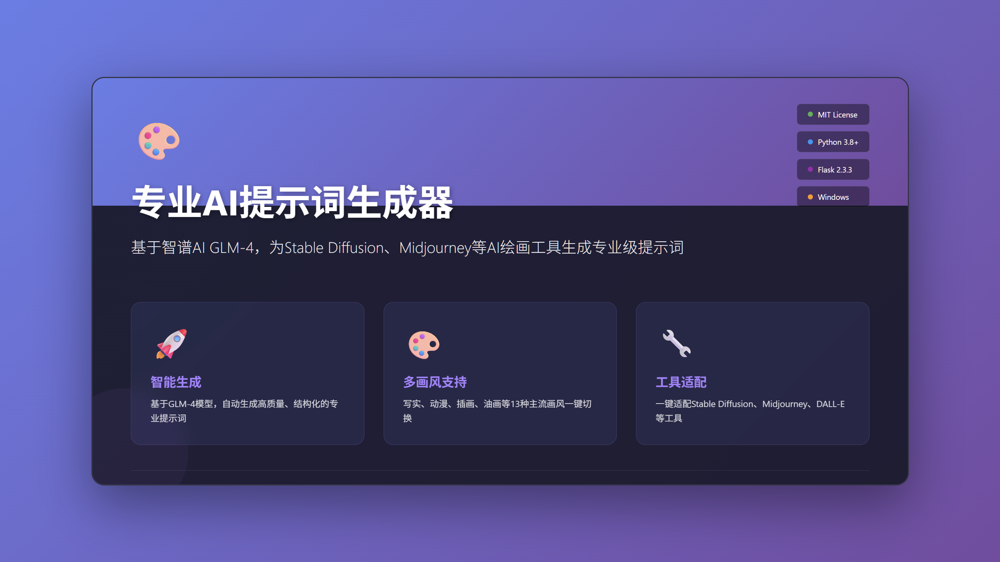

# 🎨 专业AI提示词生成器 (Prompt Tool PRO)

<div align="center">



**基于全网最佳实践，为 Stable Diffusion、Midjourney 等 AI 绘画工具生成专业级提示词**

[](https://www.python.org/downloads/)
[](https://flask.palletsprojects.com/)
[](LICENSE)
[](https://www.microsoft.com/windows)
[](https://github.com/sakura-love/prompt-tool-PRO/stargazers)
[](https://github.com/sakura-love/prompt-tool-PRO/issues)
[](https://github.com/sakura-love/prompt-tool-PRO/network/members)

[功能特性](#功能特性) • [快速开始](#快速开始) • [使用说明](#使用说明) • [技术架构](#技术架构) • [常见问题](#常见问题)

</div>

---

## ✨ 功能特性

### 🚀 核心功能
- **智能提示词生成**：基于智谱 AI GLM-4 模型，自动生成高质量的专业提示词
- **多画风支持**：写实、动漫、插画、油画、水彩、素描、3D渲染、赛博朋克、古风、像素、卡通、水墨等 13 种主流画风
- **多版本输出**：自动生成基础版、详细版、艺术版、技术版、创意版 5 种不同风格的提示词变体
- **工具适配**：一键适配 Stable Diffusion、Midjourney、DALL·E 等主流 AI 绘画工具

### 🎨 图像生成
- **火山引擎集成**：直接调用火山引擎 Seedream 模型生成高质量图像
- **豆包网页端**：一键跳转到豆包 AI 图像生成平台
- **图像下载**：支持一键下载生成的图像到本地

### 💾 数据管理
- **历史记录**：自动保存所有生成的提示词历史
- **本地存储**：所有数据保存在本地，保护隐私
- **配置管理**：支持保存/隐藏 API Key，安全便捷

### 🖥️ 用户体验
- **现代化界面**：Windows 11 Fluent Design 风格，简洁美观
- **实时进度**：可视化的进度指示器，实时显示生成状态
- **快捷键支持**：Ctrl+Enter 快速生成提示词
- **响应式设计**：适配各种屏幕尺寸

---

## 🚀 快速开始

### 环境要求

- **操作系统**：Windows 7/8/10/11 (64位)
- **Python**：3.8 或更高版本
- **内存**：最低 1GB，推荐 2GB+
- **网络**：需要互联网连接

### 安装步骤

#### 方式一：使用打包的可执行文件（推荐）

1. 下载 `专业AI提示词生成器.exe`
2. 双击运行
3. 输入 API Key 并启动应用

#### 方式二：从源代码运行

```bash
# 1. 克隆仓库
git clone https://github.com/yourusername/prompt-tool-pro.git
cd prompt-tool-pro

# 2. 创建虚拟环境（推荐）
python -m venv venv

# 3. 激活虚拟环境
# Windows:
venv\Scripts\activate
# Linux/Mac:
source venv/bin/activate

# 4. 安装依赖
pip install -r requirements.txt

# 5. 运行启动器
python launcher.py
```

### 获取 API Key

#### 智谱 AI API Key（必需）
1. 访问 [https://open.bigmodel.cn/](https://open.bigmodel.cn/)
2. 注册/登录账号后完成实名认证
3. 进入控制台
4. 创建 API Key
5. 复制 API Key

#### 火山引擎 API Key（可选）
1. 访问 [https://console.volcengine.com/](https://console.volcengine.com/)
2. 注册/登录账号后完成实名认证
3. 进入 AI 开放平台
4. 创建 API Key
5. 复制 API Key

---

## 📖 使用说明

### 基本使用流程

1. **启动应用**
   - 双击运行 `专业AI提示词生成器.exe` 或执行 `python launcher.py`
   - 在启动器界面中输入智谱 AI API Key（必需）
   - 可选输入火山引擎 API Key（用于图像生成）
   - 点击"启动应用"按钮

2. **生成提示词**
   - 在输入框中描述你想要的场景（例如："森林里的精灵少女，穿着薄纱长裙，手持发光魔杖"）
   - 选择喜欢的画风（可选）
   - 点击"生成专业提示词"按钮
   - 等待 AI 生成结果

3. **使用提示词**
   - 查看生成的正向提示词和负向提示词
   - 选择对应的 AI 工具（Stable Diffusion、Midjourney、DALL·E）
   - 点击"复制"按钮复制提示词
   - 粘贴到 AI 绘画工具中使用

4. **生成图像**
   - **火山引擎**：点击"火山引擎生成图像"按钮，等待图像生成，免费额度200次
   - **豆包网页端**：点击"豆包网页端生成"按钮，跳转到豆包平台

### 支持的画风

| 画风 | 描述 |
|------|------|
| 写实 | photorealistic, hyperrealistic, 8k, ultra detailed |
| 动漫 | anime style, manga style, vibrant colors, cel shading |
| 插画 | illustration, digital illustration, flat design, vector art |
| 油画 | oil painting, impasto, brush strokes, canvas texture |
| 水彩 | watercolor painting, watercolor texture, soft edges |
| 素描 | pencil sketch, charcoal drawing, graphite, rough sketch |
| 3D渲染 | 3D render, CGI, Octane render, ray tracing |
| 赛博朋克 | cyberpunk, neon lights, futuristic, dystopian |
| 古风 | traditional Chinese art, ancient Chinese style |
| 像素 | pixel art, 8-bit, 16-bit, retro gaming |
| 卡通 | cartoon style, animated, colorful, stylized |
| 水墨 | ink wash painting, sumi-e, traditional Asian ink art |

### 快捷键

- `Ctrl + Enter`：快速生成提示词

---

## 🏗️ 技术架构

### 技术栈

**后端**
- **Flask 2.3.3**：轻量级 Web 框架
- **Requests 2.31.0**：HTTP 请求库
- **智谱 AI GLM-4**：提示词生成模型
- **火山引擎 Seedream**：图像生成模型

**前端**
- **原生 HTML5/CSS3/JavaScript**：响应式设计
- **Windows 11 Fluent Design**：现代化 UI 风格
- **实时交互**：异步请求，实时反馈

**桌面应用**
- **Tkinter**：Python 标准库 GUI 框架
- **Threading**：多线程处理 Flask 服务
- **PyInstaller**：应用打包工具

### 项目结构

```
prompt-tool-pro/
├── app.py                  # Flask 应用主文件
├── launcher.py             # 桌面启动器
├── requirements.txt        # Python 依赖
├── build_exe.spec          # PyInstaller 配置
├── create_release.bat      # 打包脚本
├── check_release.py        # 发布检查脚本
├── 使用说明.txt           # 用户使用说明
├── templates/
│   └── index.html         # Web 界面
├── static/
│   ├── style.css          # 样式文件
│   └── script.js          # 脚本文件
├── build/                  # 构建临时文件
├── dist/                   # 打包输出目录
├── release/                # 发布文件
└── prompt_history.txt      # 提示词历史记录
```

### 核心模块

#### 1. 提示词生成模块 (`app.py:generate_prompt`)
- 接收用户输入和画风选择
- 生成结构化的提示词生成指令
- 调用智谱 AI API 进行生成
- 解析并返回 JSON 格式的结果

#### 2. 图像生成模块 (`app.py:generate_image`)
- 接收用户提示词
- 调用火山引擎图像生成 API
- 返回生成的图像 URL
- 支持图像下载代理

#### 3. 历史记录模块 (`app.py:save_history`, `app.py:load_history`)
- 保存生成的提示词到本地文件
- 加载历史记录用于显示
- 支持清除历史记录

#### 4. 桌面启动器 (`launcher.py`)
- 提供友好的 API Key 配置界面
- 管理应用配置文件
- 启动 Flask 服务并打开浏览器
- 支持 API Key 的保存和隐藏

### API 接口

| 接口 | 方法 | 功能 |
|------|------|------|
| `/` | GET | Web 界面首页 |
| `/api/generate` | POST | 生成提示词 |
| `/api/generate_image` | POST | 生成图像 |
| `/api/download_image` | POST | 下载图像 |
| `/api/save_history` | POST | 保存历史记录 |
| `/api/load_history` | GET | 加载历史记录 |
| `/api/clear_history` | POST | 清除历史记录 |

---

## 🔧 配置说明

### 环境变量

| 变量名 | 描述 | 必需 |
|--------|------|------|
| `API_KEY` | 智谱 AI API Key | 是 |
| `VOLC_API_KEY` | 火山引擎 API Key | 否 |

### 配置文件

`launcher_config.json`：

```json
{
  "api_key": "your-zhipu-api-key",
  "volc_api_key": "your-volcengine-api-key",
  "save_api": true,
  "hide_api": false
}
```

### 打包配置

`build_exe.spec`：

```python
# -*- mode: python ; coding: utf-8 -*-

block_cipher = None

a = Analysis(
    ['launcher.py'],
    pathex=[],
    binaries=[],
    datas=[('templates', 'templates'), ('static', 'static')],
    hiddenimports=['app'],
    hookspath=[],
    hooksconfig={},
    runtime_hooks=[],
    excludes=[],
    win_no_prefer_redirects=False,
    win_private_assemblies=False,
    cipher=block_cipher,
    noarchive=False,
)
```

---

## ❓ 常见问题

### Q: 启动失败怎么办？

**A:** 请尝试以下步骤：
1. 右键 exe 文件 → 属性 → 解除锁定
2. 以管理员身份运行
3. 临时关闭杀毒软件后重试
4. 检查端口 5000 是否被占用

### Q: 浏览器没有自动打开？

**A:** 手动访问 `http://127.0.0.1:5000`

### Q: API Key 无效怎么办？

**A:** 请检查：
1. API Key 是否正确复制
2. API Key 是否已过期
3. 账户是否有足够余额
4. 网络连接是否正常

### Q: 图像生成失败？

**A:** 可能的原因：
1. 火山引擎 API Key 未配置或无效
2. 网络连接问题
3. API 调用频率超限
4. 提示词包含违规内容

**解决方案：** 使用豆包网页端作为替代方案

### Q: 如何修改端口？

**A:** 编辑 `app.py` 文件第 574 行，修改端口号：
```python
app.run(debug=False, port=5000, host='127.0.0.1', use_reloader=False)
```

---

## 🤝 贡献指南

欢迎贡献代码、报告问题或提出建议！

1. Fork 本仓库
2. 创建特性分支 (`git checkout -b feature/AmazingFeature`)
3. 提交更改 (`git commit -m 'Add some AmazingFeature'`)
4. 推送到分支 (`git push origin feature/AmazingFeature`)
5. 开启 Pull Request

### 开发规范

- 遵循 PEP 8 Python 代码规范
- 添加必要的注释和文档字符串
- 保持代码简洁、可读性强
- 提交前运行测试

---

## 📄 许可证

本项目采用 MIT 许可证。详见 [LICENSE](LICENSE) 文件。

```
MIT License

Copyright (c) 2026 Prompt Tool PRO

Permission is hereby granted, free of charge, to any person obtaining a copy
of this software and associated documentation files (the "Software"), to deal
in the Software without restriction, including without limitation the rights
to use, copy, modify, merge, publish, distribute, sublicense, and/or sell
copies of the Software, and to permit persons to whom the Software is
furnished to do so, subject to the following conditions:

The above copyright notice and this permission notice shall be included in all
copies or substantial portions of the Software.

THE SOFTWARE IS PROVIDED "AS IS", WITHOUT WARRANTY OF ANY KIND, EXPRESS OR
IMPLIED, INCLUDING BUT NOT LIMITED TO THE WARRANTIES OF MERCHANTABILITY,
FITNESS FOR A PARTICULAR PURPOSE AND NONINFRINGEMENT. IN NO EVENT SHALL THE
AUTHORS OR COPYRIGHT HOLDERS BE LIABLE FOR ANY CLAIM, DAMAGES OR OTHER
LIABILITY, WHETHER IN AN ACTION OF CONTRACT, TORT OR OTHERWISE, ARISING FROM,
OUT OF OR IN CONNECTION WITH THE SOFTWARE OR THE USE OR OTHER DEALINGS IN THE
SOFTWARE.
```

---

## 🙏 致谢

感谢以下开源项目和服务：

- [Flask](https://flask.palletsprojects.com/) - 轻量级 Web 框架
- [智谱 AI](https://open.bigmodel.cn/) - 提供强大的 AI 提示词生成能力
- [火山引擎](https://console.volcengine.com/) - 提供高质量的图像生成服务
- [Tkinter](https://docs.python.org/3/library/tkinter.html) - Python 标准库 GUI 框架

---

## 📮 联系方式

- **项目地址**：[https://github.com/yourusername/prompt-tool-pro](https://github.com/yourusername/prompt-tool-pro)
- **问题反馈**：[Issues](https://github.com/yourusername/prompt-tool-pro/issues)
- **功能建议**：[Discussions](https://github.com/yourusername/prompt-tool-pro/discussions)

---

## 🌟 Star History

如果这个项目对你有帮助，请给我们一个 Star ⭐

<div align="center">

**Made with ❤️ by Prompt Tool PRO Team**

[⬆ 回到顶部](#-专业ai提示词生成器-prompt-tool-pro)

</div>
